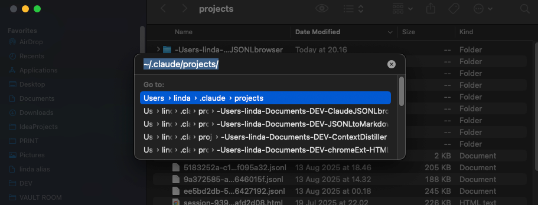

⚠️ **UNDER MAINTENANCE** - This project is still being actively developed. Some features may be incomplete or change without notice.

# Claude Code Log Viewer

A web-based tool that converts Claude Code CLI conversation logs (JSONL format) into human-readable Markdown. Features a built-in file explorer for managing multiple logs at once.

🌐 **Live Demo**: [jsonl.withlinda.dev](https://jsonl.withlinda.dev)

## What is this?

Claude Code CLI automatically saves all your conversations in JSONL format at `~/.claude/projects/`. These logs are difficult to read in their raw form. This tool makes them human-readable by:

- Converting JSONL to formatted Markdown
- Preserving conversation structure and timestamps
- Highlighting model changes and tool usage
- Organizing multiple sessions for easy browsing

## Quick Start

### Using the Web Version

1. Visit [jsonl.withlinda.dev](https://jsonl.withlinda.dev)
2. Locate your Claude Code logs:
   - **On Mac**: Press `Shift+Cmd+G` in Finder and type `~/.claude/projects/`
   - **On Linux/Windows**: Navigate to `~/.claude/projects/` in your file manager
   
   
3. Drag & drop or upload your `.jsonl` files
4. View, search, and export your conversations

### Running Locally

```bash
# Clone and install
git clone https://github.com/withLinda/claude-JSONL-browser.git
cd ClaudeJSONLbrowser
npm install

# Start development server
npm run dev
# Open http://localhost:3000
```

## Features

- **Multi-file Management**: Process multiple conversation logs simultaneously
- **Smart Parsing**: Automatically extracts session metadata, timestamps, and conversation flow
- **Search**: Find content across all loaded conversations
- **Export Options**: Download individual or combined Markdown files
- **Tool Use Formatting**: Clearly displays when Claude uses tools and their outputs
- **Model Change Tracking**: Highlights when you switch between Claude models

## What Gets Processed

The tool specifically handles Claude Code CLI log structure:

- **Session Metadata**: Session ID, Git branch, working directory
- **Message Types**: User messages, Claude responses, system summaries
- **Special Commands**: `/model` changes, tool uses, command outputs
- **Timestamps**: Preserves all timing information

## Build Instructions

```bash
# Production build
npm run build

```

## Tech Stack

- Next.js 15 with TypeScript
- Tailwind CSS (Everforest theme)
- Client-side processing (no data sent to servers)

## Why This Exists

Claude Code CLI doesn't have a built-in export feature for conversation history. This tool fills that gap, making it easy to:
- Review past conversations
- Share solutions with your team
- Create documentation from Claude interactions
- Analyze your Claude usage patterns

---

Created for the Claude Code community by [Linda](https://withlinda.dev)